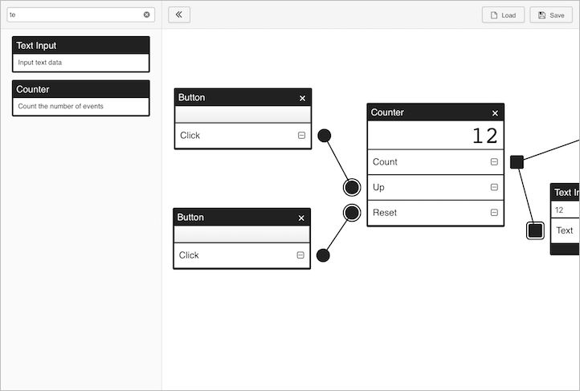

# Modular

Visual programming environment

[](https://www.ionstage.org/modular/)

## Features

- Make modules and connect them to construct data-flow(■) and event-flow(●)
- Each module has its component (like a widget) to perform and control functions
- Create custom modules and implement them locally ([How to make your own modules](./modular_modules/README.md#how-to-make-your-own-modules))

## Demo

- Counter: [Try it out](https://www.ionstage.org/modular/?demo=counter) | [Video](https://youtu.be/fnvV3ylTCN0)

- Fibonacci number: [Try it out](https://www.ionstage.org/modular/?demo=fibonacci_number)

- FizzBuzz: [Try it out](https://www.ionstage.org/modular/?demo=fizz_buzz)

- Real-time line chart: [Try it out](https://www.ionstage.org/modular/?demo=real_time_line_chart)

- Sine wave: [Try it out](https://www.ionstage.org/modular/?demo=sine_wave)

- Ruby programming (Hello world): [Try it out](https://www.ionstage.org/modular/?demo=ruby_programming_hello_world)

- Ruby programming (FizzBuzz): [Try it out](https://www.ionstage.org/modular/?demo=ruby_programming_fizz_buzz)

- Play YouTube Video: [Try it out](https://www.ionstage.org/modular/?demo=play_youtube_video)

- YouTube Music Player: [Try it out](https://www.ionstage.org/modular/?demo=youtube_music_player)

## Running locally

- Install [Node](https://nodejs.org/en/download/)
- Install the dependencies

```
npm install
```

Then run:

```
npm start
```

Works on IE11, Firefox, Safari, Chrome.

## License

&copy; 2017 iOnStage
Licensed under the MIT License.
