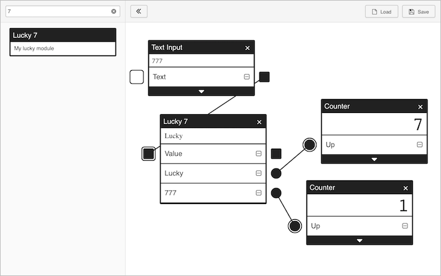

# Modular modules

A Modular module is a component of a Modular program.
There are some packages to classify the modules in their function.
You can create your own modules and implement them locally.

## Packages

- **core**: base components (button, text-input...)
- **math**: mathematical functions
- **x/game**: particular form of playing games
- **x/programming**: programming environment
- **x/youtube**: interaction with YouTube service

## How to make your own modules

### 1. Download this repository and install the dependencies

```
git clone https://github.com/ionstage/modular.git
cd modular
npm install
```

### 2. Prepare a package for custom modules

Make a folder of your package under `modular_modules` folder.
In this example, create `my-special` package to contain custom modules.

```
cd modular_modules
mkdir my-special
```

### 3. Edit `modular_modules/index.json`

Append "my-special" to `modular_modules/index.json` file.
This file represents the list of package names.

```
[
  ...,
  "my-special"
]
```

### 4. Design your custom module

Creating Modular module is to design functionality of the module's `prop` ports and `event` ports.
Each port has an input-socket and an output-plug.

A `prop` port's input-socket and output-plug have a square shape.
You can construct a data-flow by connecting a square output-plug(■) to a square input-socket(□).

An `event` port's input-socket and output-plug have a round shape.
You can construct a event-flow by connecting a round output-plug(●) to a round input-socket(○).

In this example, create `Lucky 7` module. The function of each port is as follows.

- **prop**
  - `Value`: output the word "Lucky" if the input value contains the word "7"
- **event**
  - `Lucky`: dispatch event if the output value is changed to "Lucky"
  - `777`: dispatch event if the input value is changed to "777"

### 5. Create HTML file for the custom module

The component of the module and the functionality of the ports are implemented in a HTML file.

In this example, create `modular_modules/my-special/lucky7.html` file for the custom module.
The following code is the whole HTML code with comments on the points to keep in mind.

```html
<!DOCTYPE html>
<html>
<head>
  <meta charset="utf-8">
  <title></title>
  <style>
    body {
      /* should fix the height of the document to show the component of the module correctly */
      height: 18px;
    }
  </style>
</head>
<body>
  <div id="content"></div>

  <!-- must load this JavaScript source -->
  <script src="../modular-module.js"></script>

  <script>
    (function() {
      var isLucky = false;
      var contentElement = document.getElementById('content');

      // function for `Value` prop
      var valueProp = function(input) {
        // argument `input` is an input value
        var word = String(input || '');
        var output;

        if (word.indexOf('7') !== -1) {
          output = 'Lucky';

          if (!isLucky) {
            isLucky = true;

            // dispatch `Lucky` event
            // `module.get` method is used to get the function for the port
            module.get('lucky')();
          }

          if (word === '777') {
            // dispatch `777` event
            module.get('777')();
          }
        } else {
          output = '';
          isLucky = false;
        }

        // update DOM element for showing the output value
        contentElement.textContent = output;

        // return value is an output value
        return output;
      };

      /*
       * `modular.Module` constructor create Modular module object with the
       * list of port's definition. Each property of the definition object is
       * as follows.
       *   - label: title of the port
       *   - name: key for `module.get` method
       *   - type: type of the port (`prop` or `event`)
       *   - arg: function or an initial value for the port
       *   - plugDisabled: setting to disable the plug (default: false)
       *   - socketDisabled: setting to disable the socket (default: false)
       */
      var module = new modular.Module([
        { label: 'Value', name: 'value', type: 'prop', arg: valueProp },
        { label: 'Lucky', name: 'lucky', type: 'event', socketDisabled: true },
        { label: '777', name: '777', type: 'event', socketDisabled: true },
      ]);

      // export the module object
      modular.exports = module;
    })();
  </script>
</body>
</html>
```

The HTML file of other modules in `modular_modules` folder serves as a useful sample for your development.

### 6. Make `modular_modules/[your package name]/index.json`

Create and edit `modular_modules/my-special/index.json` file.
This file represents the list of a module entry of `my-special` package.
Each property definition of a module entry is as follows.

- **label**: title of the module
- **description**: outline of the module
- **src**: file name of the module (without extension)
- **visiblePortNames**: port names of the module for showing by default
- **tags**: keywords in searching for the module

The following example is the file content for `my-special` package with the module entry of `Lucky 7` module.

```json
[
  {
    "label": "Lucky 7",
    "description": "My lucky module",
    "src": "lucky7",
    "visiblePortNames": ["value", "lucky"],
    "tags": ["lucky", "7", "777"]
  }
]
```

Whenever you create another module, you must append the module entry to this file.

### 7. Run Modular and play with your custom module

```
cd ../
npm start
```



Enjoy!
